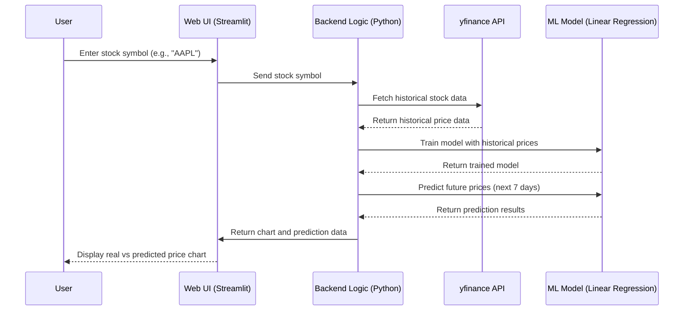

# Full README content including Mermaid diagram
full_readme_content = """# 📈 Stock Price Analyzer (AI-Powered)

A simple web app that predicts stock trends using linear regression and historical stock price data. Built with Python, yfinance, and Streamlit.

---

## 🧠 Features
- Fetches historical stock data (1 year)
- Predicts stock price for the next 7 days
- Displays interactive charts of actual vs. predicted prices
- Trend direction indicator (Upward or Downward)
- Built with Streamlit (no need to write frontend manually)

---

## 🖼️ App Preview
Coming soon with Streamlit Cloud deployment!

---

## 🔁 Sequence Diagram (Mermaid)



## VENV
```python -m venv .venv
source .venv/bin/activate  # หรือ .venv\\Scripts\\activate สำหรับ Windows
pip install -r requirements.txt
```
## How to run

```
# 1. Clone the repository
git clone https://github.com/your-username/stock-price-analyzer.git
cd stock-price-analyzer

# 2. Create virtual environment
python -m venv .venv
source .venv/bin/activate  # For Windows: .venv\Scripts\activate

# 3. Install dependencies
pip install -r requirements.txt

# 4. Run the app
streamlit run app.py
```

| Question                       | Answer                                                                 |
| ------------------------------ | ---------------------------------------------------------------------- |
| What does this app do?         | Analyzes stock price trends using historical data                      |
| What data does it use?         | Closing prices of stocks from Yahoo Finance (`yfinance`)               |
| What model is used?            | Linear Regression                                                      |
| How does it process data?      | Converts dates to numeric values, trains the model, predicts prices    |
| What technologies are used?    | Python, yfinance, scikit-learn, matplotlib, Streamlit                  |
| What are the limitations?      | Linear regression assumes linearity → not suitable for volatile stocks |
| How do users interact with it? | Enter a stock symbol → get historical chart + future predictions       |
| How could it be improved?      | Add LSTM model, news sentiment analysis, or other market features      |
